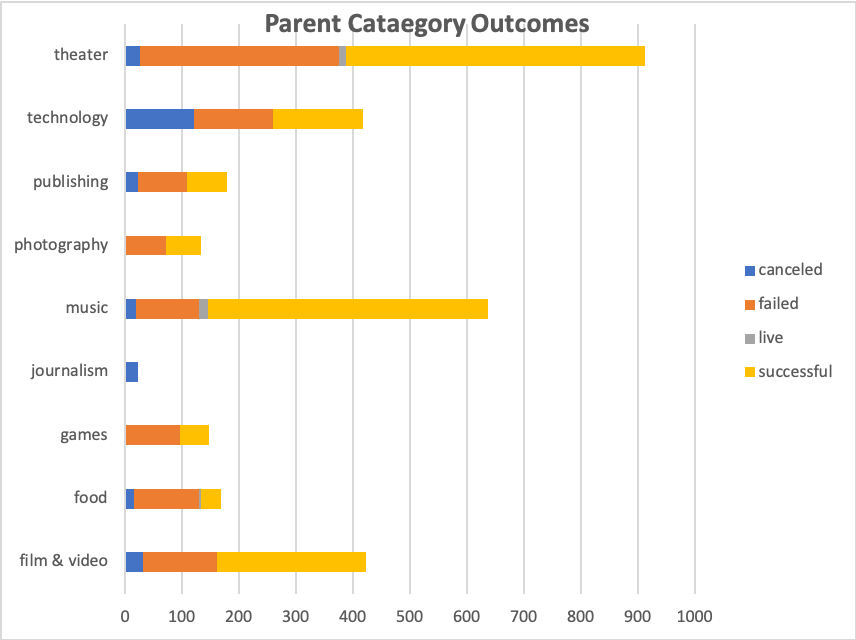
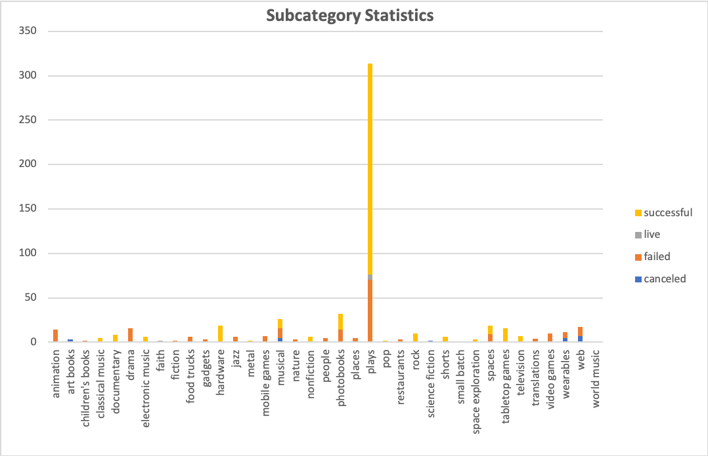
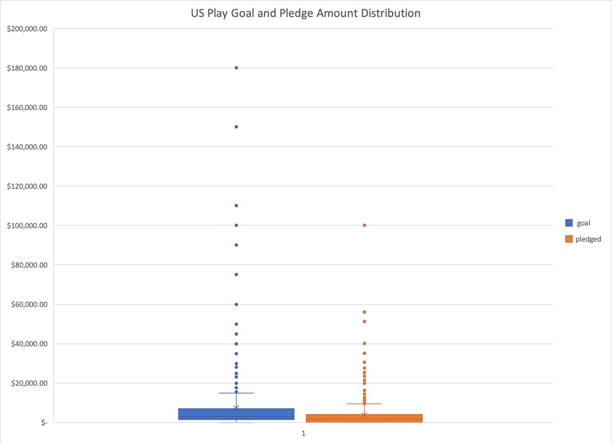

#An Analysis of kickstarter Campaigns
---
What we wanted to know: Help Louise fund her play Fever which has a budget of 10K by Analysising the past campaign data  

At a glance we can see that plays typically have a successful campaign. From the Worksheet labeled "Parent Category Outcomes" we can see the US theater campaigns have a success rate of 57.5% and the "Subcategory Statistics" worksheet show US Plays campaigns have a 61.4% success rate.

*Parent Catagory chart*

*Subcategory Chart*

Looking at the time of year when campains start, we can see that campaigns starting in the months of May and June have move success, and trends down until December. 

Based on the Edinburgh Reserch, we can see these Averaged data points 
- Goal was $2,0000
- Pledge $2,384
- Donation $40.48
- Number of Pledges 62.4

Our Descriptive stats there is a large difference between the mean and IQR of goal, which suggest some outliers in out data that is pushing out mean up. The same can be seen with the pledge amounts, the mean is closer to the upper Quartile. In addition to this, the standard deviation is high which means the values are wide spread from the mean.

In the graph below we can see that ther are many data points that are above the upper quartile which are considered outliers and skew our data. 

__I would suggest filtering plays by goal ranking to understand success of a campaign based on category and goal amount.__
