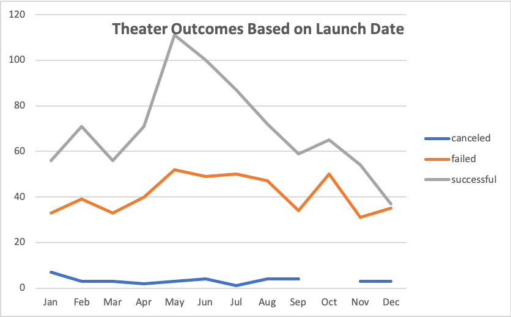
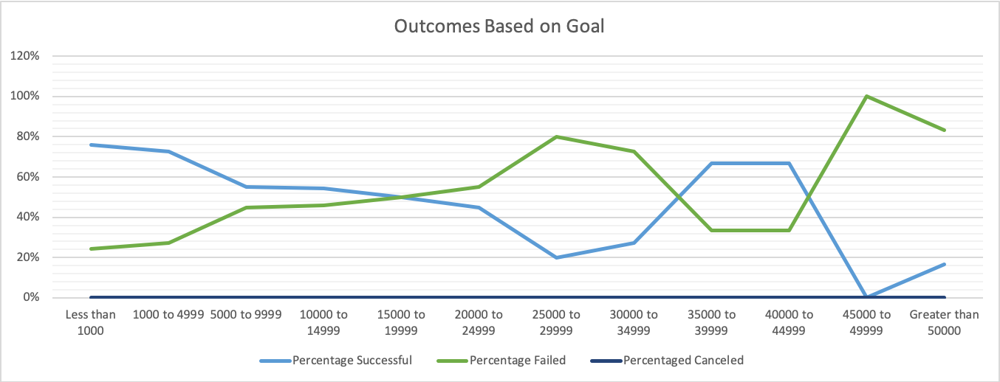

# Kickstarter Analysis Complete

---
## Overview of Project
### Purpose
The purpose of this exercise was to compare Louise's play *Fever* to other campaigns with similar launch dates and fundraising goals. We also would like to visualize campaign outcomes based on their launch date and funding goals. As a result, I hope to provide better insight into these two factors that have yielded successful campaigns in the past.

---
## Analysis and Challenges
### Analysis of Outcomes Based on Launch Date
I looked at Theater outcomes based on the month it was launched, which can also be filtered by year. The graph shows each months' Successful, Failed, and Canceled Theater campaigns' by count. 

### Analysis of Outcomes Based on Goals
Based on an earlier analysis, we were able to determine that there were outliers that skewed our data because the average is closer to the upper quartile as shown in the descriptive stats workbook. [https://github.com/Raquely44/kickstarter-analysis/blob/master/Resources/Descriptive%20Stats.png] Instead of looking at all plays solely based on subcategory and country, I categorized plays based on their goal amount. Then calculated the Successful, Failed, and Canceled percentage and created a line graph as a visual representation of the data.

### Challenges and Difficulties Encountered
A challenge with this data was formating the dates from Epoch to a date format that is more easily readable. I was able to use a simple excel formula =(C2-DATE(1970,1,1)) * 86400 to accomplish this and use the new data for further analysis.

---
## Results
- From the analysis we can determine the best months to start a campaign are May and June, whereas the worst month is December. We can also conclude that there is a trend line from the months of January to May upwards that shows an increase in successful campaigns launched in this time period, with the exception of the month of March. 
- The most successful goal amount is less than $1,000 and the least is $45,000 to $49,999. It is interesting to note that the second most successful campaign by goal amount is $35,000 to $39,999 and $40,000 to $44,999 range. 
- A limitation of the data is that we do not know if all campaigns were marketed using the same platforms and how much money was spent on each campaign. This can have a major impact on how successful the campaign was. 
- I would recommend determining the length of the campaign to better understand campaign success for forecasting shown as a line chart. I would also recommend analyzing how many backers it took to fund campaigns based on category and goal amount to understand the interest of our audience shown as a bar graph.  
